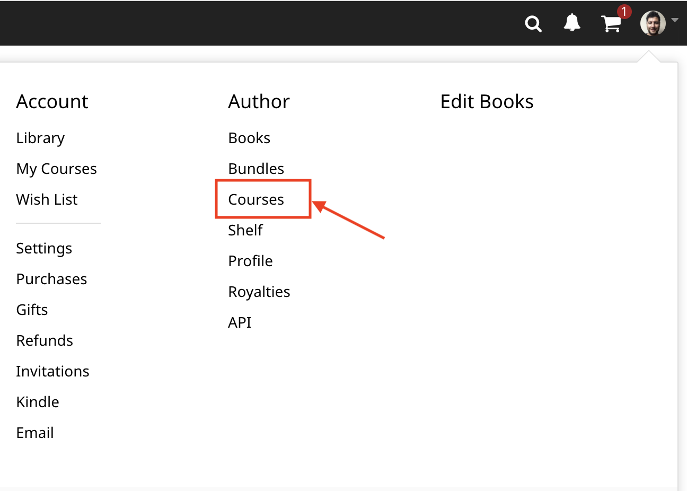
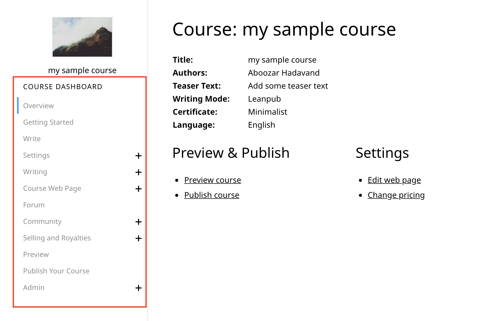

# Simple guide to publish your first course on Leanpub

Leanpub started as a online publishing platform with the philosophy of making it easier to publish, to publish early and publish often. It's said that one of the advantages of Leanpub is that authors don't have to sweat the mistakes. They can continuely edit and improve their book by publishing newer editions of the book. The final course is never really final. You can edit, and notify learners of your course updates, meaning you can publish regularly after pushing out an early draft.

They have recently added Leancourses which is a MOOC version of their book publishing arm with having some courses specifically designed for as online course such as quizzes, exercises, and certificates.

What is good about Leanpub and Leancourses is that creating a book or couses is as easy as creating an account, starting a book or course by linking it to a Dropbox folder (or equivalenty a Github repository) that has the content and executing it as a book or course. In the following sections we'll go over some of the basics of creating a course on Leanpub courses.

## How to create a new course

Assuming you have authoring access on your Leanpub account, you can click on your account and choose Courses under Author like below.

In the following page, click on "Create another Course" which then opens a new page where you should enter course information such as the title, url, etc. You need to enter the following information:
- Choose a title
- Enter the url of the course (choose something that is good for SEO purposes: introduction_to_molecular_biology instead of my_first_course)
- Select language
- Select how you want to write the course.

For the last step, you should choose an option based on how comfortable you are with writing in plain text markup languages or Github. If you have worked with Github, it's better to link your course content with a Github repo for versioning purposes. Otherwise you can choose to link to the content on Dropbox.

We suggest to spend half hour to learn Markdown (yes, it's that easy!) instead of Word documents. To add more features for MOOCs, Leanpub has added a few more typesets and features to Markdown and they call it Markua. Leanpub courses are written using [Markua](http://markua.com). You can read the relevant section of the Markua specification document [here](https://leanpub.com/markua/read#leanpub-auto-quizzes-and-exercises).

You can find more information on creating a course or MOOC [here](https://leanpub.com/markua/read#leanpub-auto-creating-a-course-or-mooc-from-a-markua-document).

## Linking to Dropbox or Github

If you're using Dropbox or GitHub, create the file in the `manuscript` folder for this course. Then open the `Book.txt` file you'll find in the `manuscript` folder, and type in the name of your new file, including its file extension (like the `.txt` in `Book.txt`) **on a line by itself**. That way, the next time you create a preview of your course, the new file will be included.

You can write your content in text or Markdown formats. Markdown files end in .md and are actually saved in a text file. You can create a Markdown document in most text editors (even the ones that come with your Mac or Windows). When saving, just save your file as `myfilename.md`. You can write each lesson in one Markdown document and tell Leanpub the order in which your lessons shouls appear in the `Book.txt` file.

Note that all the images should be saved in a directory called `images` in another directory called `resources`. You can link to your images by typing `images/my_image.png`.

## Quiz Example

Here is a brief example of a multiple choice question in a quiz. The correct answer is the one with an upper-case letter, in this case `B)`.

{quiz, id: quiz1}
? How many letters are in the word Markua?

a) 5
B) 6
c) 7
{/quiz}

Here is an example of a question where the student types their answer. You indicate the answer by typing `!` and then a space, and then the answer.

{quiz, id: quiz2}

? How many unique letters are in the word Markua?

! 5
{/quiz}

## Exercise Example

Here is an example of a multiple choice question in an exercise.

{exercise, id: exercise1}
? How many letters are in the word Markua?

a) 5
B) 6
c) 7

## More on editing

There's a lot more you can do when you're making courses with Markua. Here's a brief list of what else you can do:

* Assign a specific number of points to each question
* Make written or "fill in the blank" answers case-sensitive
* Specify the maximum number of lines or pages for an answer
* Assign more than one correct answer to a question
* Set it so the possible answers to a multiple choice question are presented in a random order to students

## Changing Course Settings

Another important step in authoring your course is to set the setting for authors, prices, etc. All of these can be found on the menu on the left side. 

01_authoring_bar

One of the nice things about Leanpub is the fact that you can easily add more authors and set the royalties. To do this, click on Settings on the left-side menu and choose Authors. You can then add more authors either by knowing their Leanpub username or inviting them to Leanpub through their emails and set what percentage of the sale goes to them. In order for their name to show up on the course, they will have to accept your invitation.

You can choose to give a certificate signed by you to those who pass the course. This can be done by clicking on Settings > Certificate. The instructor also chooses what the passing mark and honor marks are. For instance, you can choose the passing rate at 80% and the honor rate at 90% by going to Settings > Mark Ranges.

Another important aspect of Leanpub is it's pricing system:
- Instructors receive most of the royalties (instead of the publisher or MOOC provider) 
- Instructors can choose to provide a course for free or let the learner choose the price they want to pay.

To set pricing, go to Selling and Royalties > Pricing and choose the range of price you want. You can set the minimum at zero and the maximum at the price you think it's reasonable. 

## Publishign your course

Finally, after your content is ready and you have set the course settings on what you want, you can publish your course by clicking on Publish Your Course. If everything is in place, your course will be published.